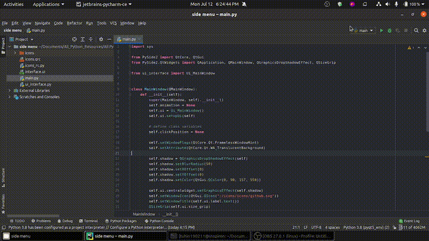

# PySide2-Side-Menu
Implementation of side menu and QPropertyAnimation of PySide2

## Package Requirements
```bash
$ pip install PySide2
```
## Preview
<p align="center">
    
</p>

<hr>
<br>
<br>
<br>
<br>

## Inspired from videos of [Spinn TV](https://www.youtube.com/channel/UCJVsWdUC3M8p-q67RXPujkg)